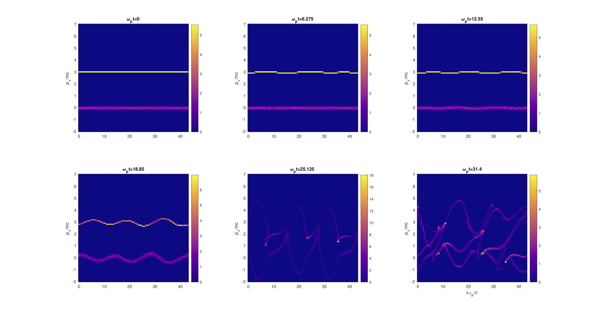
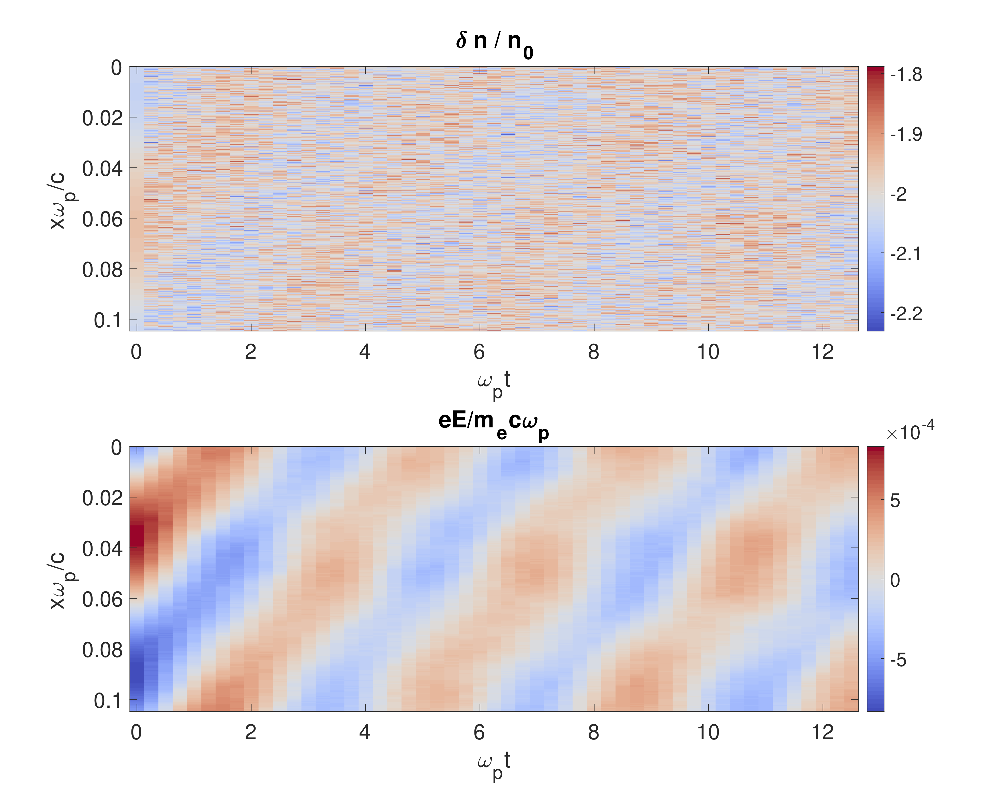

# SimplePIC
A simple electrostatic particle-in-cell code made for NERS 574 at UMich.

There should be very little the user has to do to actually use the code. The code itself uses normalized units, where time is normalized against the plasma frequency, momentum to m_e c, distance to plasma frequency / c, etc.
main() is contained within pic.cpp. All the set up for the parameters in the simulation, species definitions, E and B field initializations, etc. are to be provided by the user in a .h file that is included in the pic.cpp file.
A few examples of how this is done can be seen in uh.h (upper hybrid waves), two_stream.h (two-stream instability), beam_plasma.h (beam-plasma instability), or landau.h (Landau damping).

The pictures below are meant to showcase some of the capabilities of this code.

Two-Stream Instability:

Beam-Plasma Instability:

Landau Damping:

